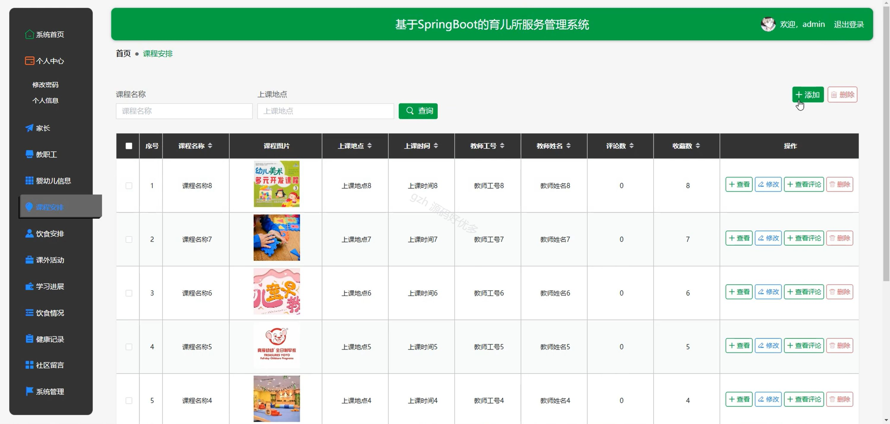

# springbootA280D
springbootA280D育儿所服务管理系统
 
## 查看主页获取源码

### 一、关键词
婴幼儿信息、婴幼儿课程安排、婴幼儿饮食安排

### 二、作品包含
源码+数据库+全套环境和工具资源+本地部署教程

### 三、项目技术
前端技术：Html、Css、Js、Vue2.0、Element-ui 
后端技术：Java、SpringBoot2.0、MyBatis

### 四、运行环境（以下版本亲测，其他版本未知，请自测）
开发工具：IDEA/eclipse  + VSCODE

数据库：MySQL5.7（最低要5.7版本）

数据库管理工具：Navicat10以上版本

环境配置软件： JDK1.8 + Maven3.6.3

前端Nodejs：14

浏览器：谷歌浏览器

### 五、项目介绍
项目编号：springbootA280D

育儿所服务管理系统可整合幼儿信息登记等功能，助力育儿所高效规范地开展服务与管理工作。

角色：管理员、用户、教职工

管理员功能：系统首页、个人中心、家长、教职工、婴幼儿信息、课程安排、饮食安排、课外活动、学习进展、饮食情况、健康记录、社区留言、系统管理。

用户功能：首页、教职工、课程安排、饮食安排、课外活动、通知公告、社区留言、个人中心、修改密码、聊天记录、婴幼儿信息、学习进展、饮食情况、健康记录、我的收藏。

教职工功能：系统首页、个人中心、婴幼儿信息、课程安排、饮食安排、课外活动、学习进展、饮食情况、健康记录。

### 六、运行截图

